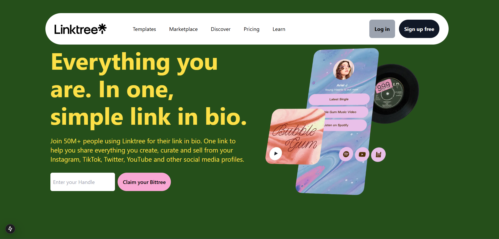
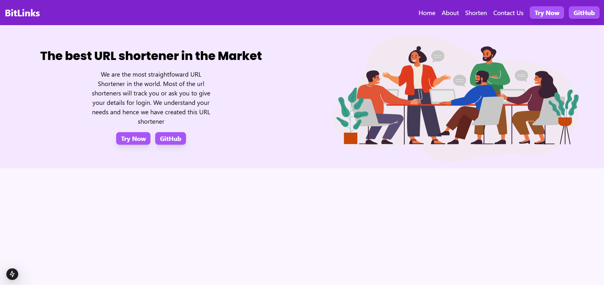
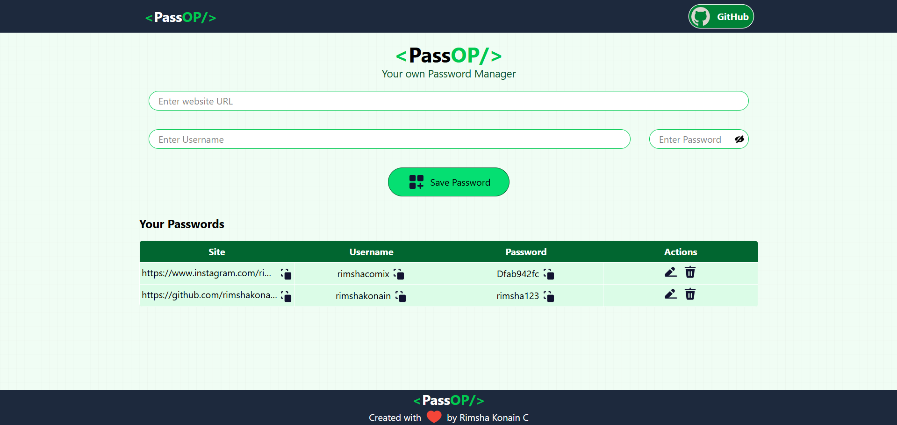
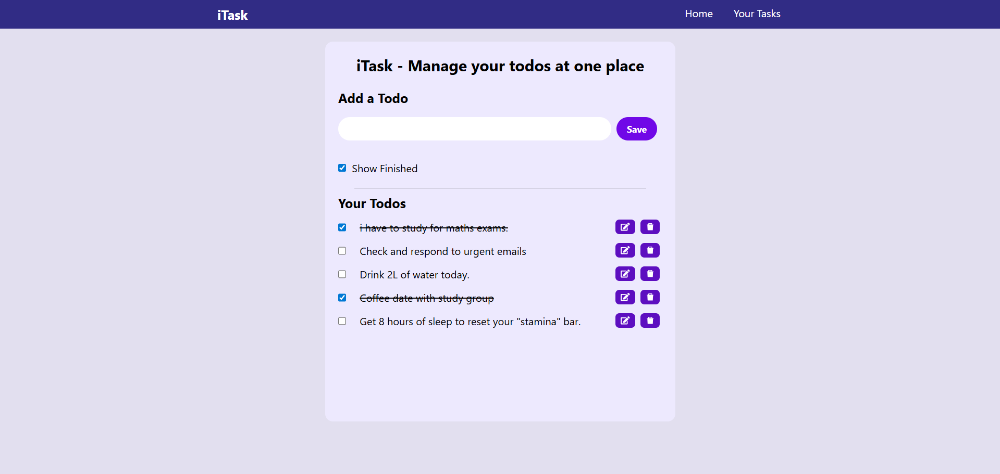
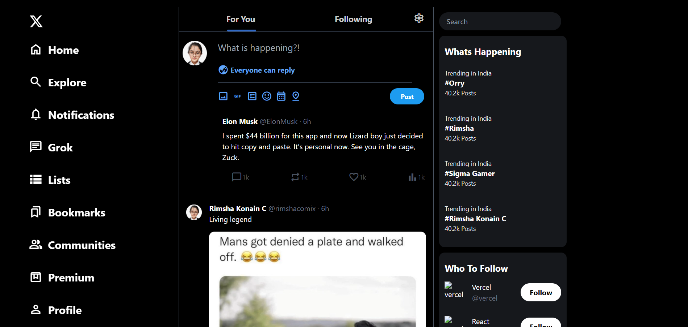
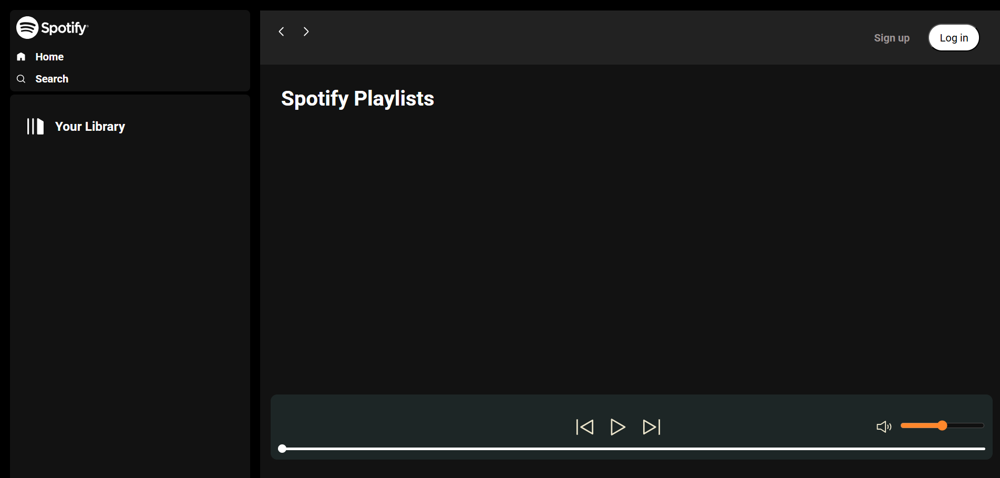
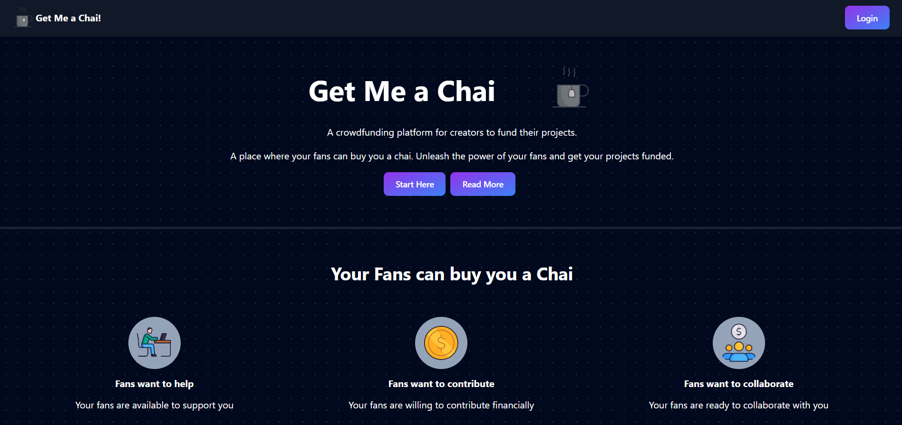

# Hello World 〘 ◯ ▢ ∆ ▢ ◯ 〙 I'm Rimsha Konain C

**Full-Stack MERN & Next.js Developer**

---

<h2 align="left">💡 Skills & Expertise</h2>

### Frontend
 
 
 
 
 
 
  
 

### Backend & Database
 
 
 
 
 
  
 

### Deployment & Tools
  

---

<h2 align="left">🖼️ Selected Works</h2>

<!-- Row 1 -->

| **BitTree 🌳** | **BitLinks 🔗** |
| :---: | :---: |
|  |  |
|         **🔗 Everything you are. In one, simple link in bio.**   One link to help you share everything you create, curate and sell from your Instagram, TikTok, and other social profiles.   |         **🌐 The best URL shortener in the Market**   The most straightforward URL shortener no tracking or login required.We understand your needs,so we created a tool that just works.   |
| [Repo](https://github.com/rimshakonain/BitTree) | [Repo](https://github.com/rimshakonain/BitLinks) |

 

<!-- Row 2 -->

| **PassOP 🔐** | **iTask ✅** |
| :---: | :---: |
|  |  |
|         **📊 Data Analytics Dashboard**   Real-time business intelligence dashboard with interactive charts, KPI tracking, and custom security reporting.   |         **🎯 Task Management App**   Productivity app with task scheduling, reminders, team collaboration, and progress tracking features.   |
| [Repo](https://github.com/rimshakonain/PassOP) | [Repo](https://github.com/rimshakonain/iTask) |

 

<!-- Row 3 -->

| **Twitter UI 🐦** | **Spotify Clone 🎵** |
| :---: | :---: |
|  |  |
|         **📱 Responsive Web Portal**   Modern full-stack web portal with responsive design, pixel-perfect UI recreation, and mobile optimization.   |         **🎵 Media Analytics Player**   Real-time audio engine with local file management, interactive controls, and playlist tracking.   |
| [Repo](https://github.com/rimshakonain/Twitter-UI) | [Repo](https://github.com/rimshakonain/Spotify) |

 

<!-- Final 7th Place -->

| **GetMeAChai ☕** |
| :---: |
|  |
|         **☕ Creator Crowdfunding Platform**   Patreon-style solution for creators with Razorpay payment integration, supporter management, and real-time contribution tracking.   |
| [Repo](https://github.com/rimshakonain/GetMeAChai) |

---

<h2 align="left">📊 GitHub Analytics</h2>

  
  
  
  

  
    
  
  <!--  -->
  

  
  

---
 
### 🏆 GitHub Trophies
  

---

### ✍️ Random Dev Quote

<!-- Snake Game Repo View -->

  

